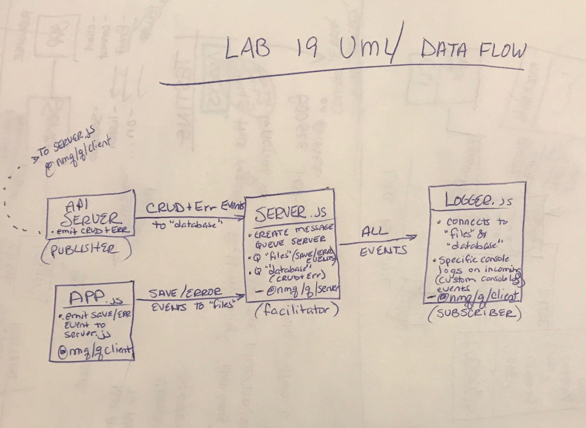

# lab-19-api-server
Lab 19: API Server

### Author: Chloie Parsons 

## Links and Resources
* [Submission PR](https://github.com/chloieparsons-401-advanced-javascript/lab-19-api-server/pull/1)
* [Travis](https://www.travis-ci.com/chloieparsons-401-advanced-javascript/lab-19-api-server)


## Modules
* ```server.js``` 
    - Imports Queue client library and publishes events on all CRUD+E (create, read, update, delete, error) events.

* ```index.js``` 
    - Connects MongoDB to server and starts up server.

## Running the app
* ```npm i``` (to install dependencies)

* ```npm run start``` (fires up node server.js)

* Environment Variables
   - PORT
   - MONGODB

## Tests
* ```npm run test```
* ```npm run test-watch```
* ```npm run lint```

## UML
